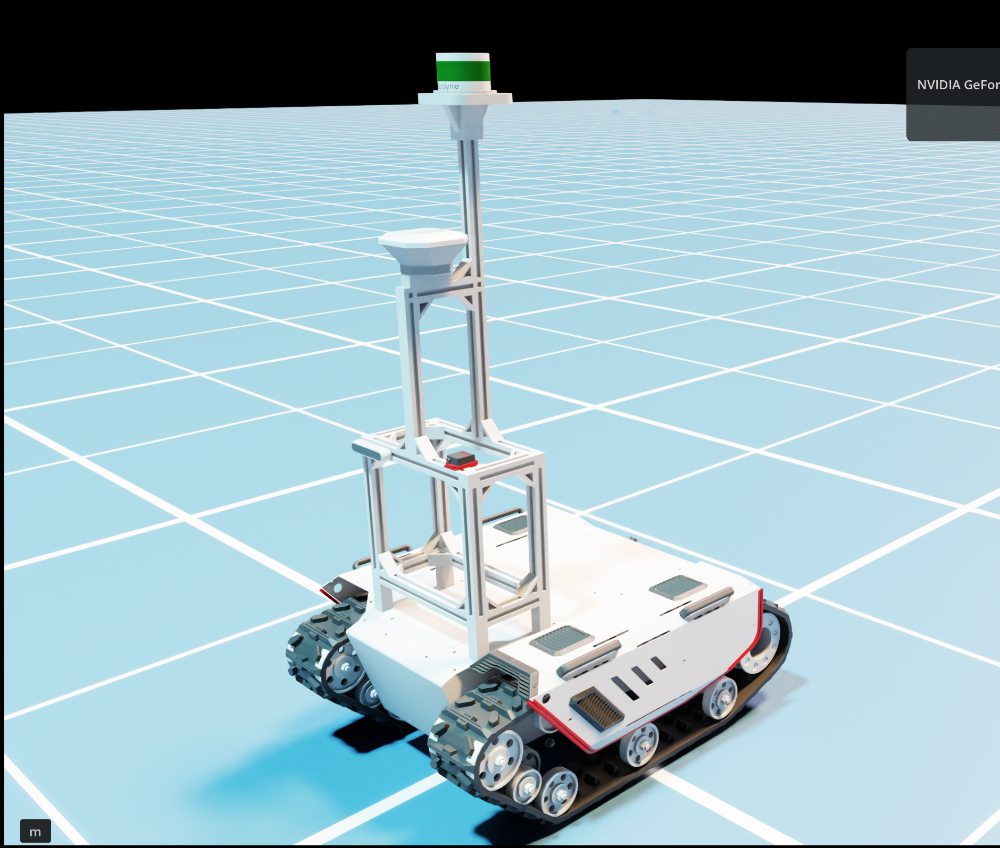
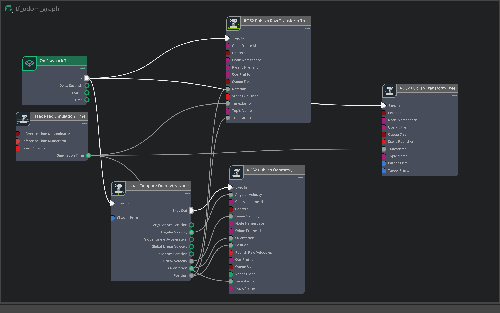
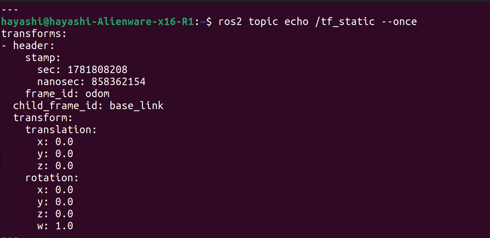
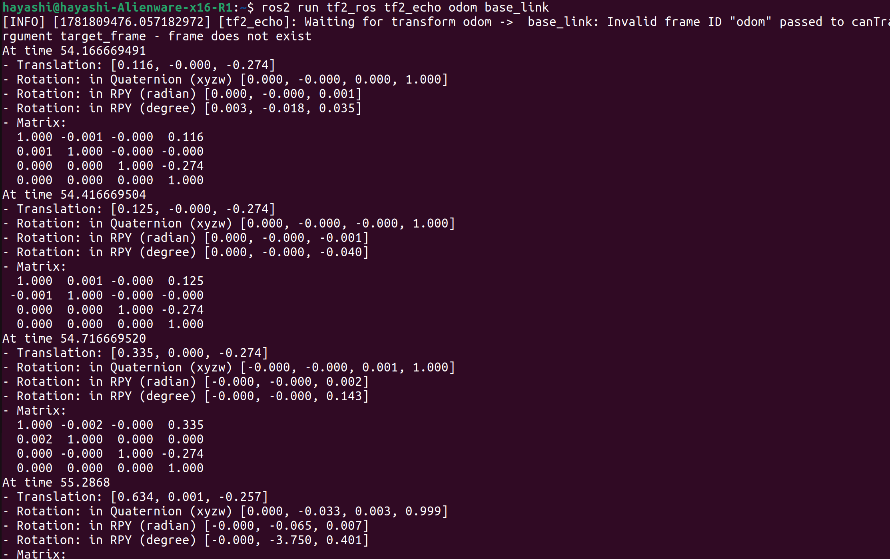
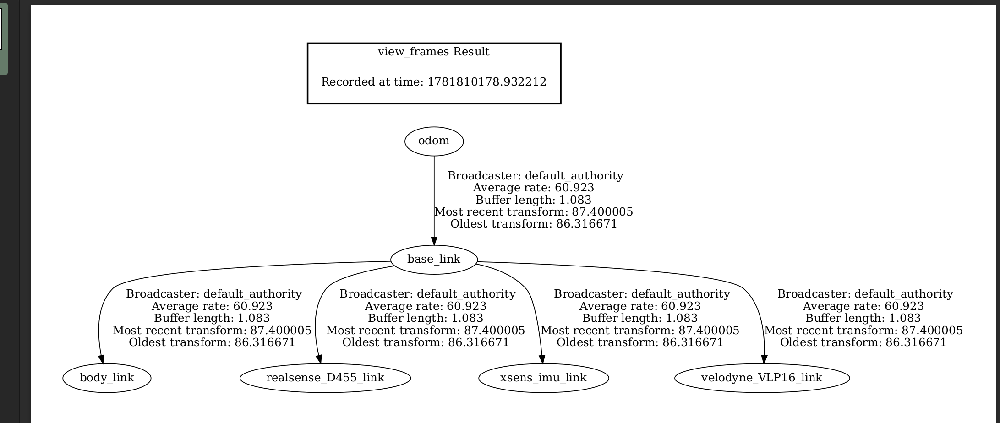

# 2026-06-19 — ROS2 TF and Odometry Integration Completed

## Objective

Establish a complete ROS2 TF and odometry pipeline inside Isaac Sim to support future SLAM, localization, and navigation experiments.



*Figure 1. Current Bunker simulation platform configured with LiDAR, RGB-D camera, IMU, TF tree, and odometry.*

---

## Background

Previous sensor validation confirmed successful publication of:

- LiDAR point clouds
- RGB camera images
- Depth images
- IMU data
- Camera calibration information

However, the navigation stack remained incomplete because the required transform between `odom` and `base_link` was not being published.

This prevented RViz, SLAM systems, and navigation frameworks from constructing a complete robot frame hierarchy.

---

## Initial Problem

Odometry messages were successfully published:

```bash
ros2 topic echo /odom --once
```

Output confirmed:

```yaml
frame_id: odom
child_frame_id: base_link
```

However:

```bash
ros2 run tf2_ros tf2_echo odom base_link
```

returned:

```text
Invalid frame ID "odom"
```

RViz also reported:

```text
Frame [odom] does not exist
```

indicating that the odometry message existed but the corresponding TF transform did not.

---

## Existing TF Tree Investigation

Inspection of:

```bash
ros2 topic echo /tf --once
```

showed only sensor transforms:

```text
base_link → body_link
base_link → realsense_D455_link
base_link → xsens_imu_link
base_link → velodyne_VLP16_link
```

The critical transform:

```text
odom → base_link
```

was missing.

---

## Debugging Timeline

### 1. RViz Validation Failure

RViz could not use:

```text
odom
```

as the Fixed Frame.

Errors:

```text
Frame [odom] does not exist
```

---

### 2. TF Lookup Failure

Running:

```bash
ros2 run tf2_ros tf2_echo odom base_link
```

returned:

```text
Invalid frame ID "odom"
```

indicating the frame did not exist in the TF tree.

---

### 3. Sensor TF Verification

Inspection of:

```bash
ros2 topic echo /tf --once
```

confirmed only:

```text
base_link → body_link
base_link → realsense_D455_link
base_link → xsens_imu_link
base_link → velodyne_VLP16_link
```

were being published.

---

### 4. Temporary Static Transform Test

To isolate the issue:

```bash
ros2 run tf2_ros static_transform_publisher \
0 0 0 0 0 0 odom base_link
```

was launched.

Results:

- RViz accepted `odom`
- TF tree became valid
- Sensor hierarchy appeared correctly

This confirmed the missing transform was the root cause.

---

### 5. Isaac Omnigraph Inspection

Existing nodes:

```text
Isaac Compute Odometry
ROS2 Publish Odometry
ROS2 Publish Transform Tree
```

Observations:

- `/odom` topic published correctly
- Sensor transforms published correctly
- No node generated:

```text
odom → base_link
```

---

## Isaac Sim Graph Modification

A new node was added:

```text
ROS2 Publish Raw Transform Tree
```

Configuration:

```text
Parent Frame Id = odom
Child Frame Id  = base_link
Static Publisher = False
```

Connections:

```text
On Playback Tick
    → Exec In

Isaac Read Simulation Time
    → Timestamp

Isaac Compute Odometry Position
    → Translation

Isaac Compute Odometry Orientation
    → Rotation
```



*Figure 2. Final Omnigraph configuration used to publish odometry and dynamic transforms.*

---

## Validation

### TF Publication

Verification:

```bash
ros2 topic echo /tf --once
```

Output:

```yaml
frame_id: odom
child_frame_id: base_link
```



*Figure 3. Successful publication of the odom → base_link transform.*

---

### Dynamic Transform Validation

Verification:

```bash
ros2 run tf2_ros tf2_echo odom base_link
```

Output updated continuously during robot motion:

```text
Translation: [0.125, 0.000, -0.274]
Translation: [0.335, 0.000, -0.274]
Translation: [0.955, 0.010, -0.264]
Translation: [2.729, 0.151, -0.289]
```

Robot position and heading changed correctly as the robot moved.



*Figure 4. Dynamic odom → base_link transform updating during robot motion.*

---

## Final TF Tree

Verification:

```bash
ros2 run tf2_tools view_frames
```

Final hierarchy:

```text
odom
 └── base_link
      ├── body_link
      ├── realsense_D455_link
      ├── xsens_imu_link
      └── velodyne_VLP16_link
```



*Figure 5. Final ROS2 TF hierarchy generated after odometry integration.*

This hierarchy matches the structure required by:

- RTAB-Map
- SLAM Toolbox
- Nav2
- robot_localization

---

## Additional Findings

### Dynamic Odometry Verified

Driving the robot confirmed:

- Position updates
- Orientation updates
- TF updates
- Consistent odometry publication

Pipeline:

```text
Joystick
    ↓
cmd_vel
    ↓
Differential Drive Controller
    ↓
Robot Motion
    ↓
Isaac Compute Odometry
    ↓
ROS2 Publish Odometry
    ↓
odom → base_link TF
```

---

### Vertical Offset Observation

Observed:

```text
odom → base_link

z ≈ -0.289 m
```

Although `base_link` itself appears correctly positioned inside Isaac Sim, odometry introduces a constant vertical offset.

Potential causes:

- Articulation root offset
- Physics root transform
- USD import origin mismatch

This does not currently prevent SLAM operation and will be investigated later.

---

## Session Outcome

### Completed

- [x] ROS2 Odometry Publication
- [x] Sensor TF Publication
- [x] Dynamic odom → base_link TF
- [x] RViz Fixed Frame Validation
- [x] Motion Tracking Validation
- [x] TF Lookup Validation
- [x] Final TF Tree Verification

### Pending

- [ ] Investigate vertical offset in odometry
- [ ] RTAB-Map integration
- [ ] Mapping experiments
- [ ] Loop closure testing
- [ ] Navigation stack validation

---

## Status

The Isaac Sim Bunker platform now provides:

- Velodyne VLP16 LiDAR
- Intel RealSense D455 RGB-D camera
- Xsens IMU
- ROS2 TF hierarchy
- ROS2 odometry
- Dynamic robot transforms

The simulation environment is now considered SLAM-ready.

Next milestone:

```text
RTAB-Map Integration
      ↓
Map Generation
      ↓
Loop Closure Validation
      ↓
Nav2 Integration
      ↓
Traversability Learning Pipeline
```
