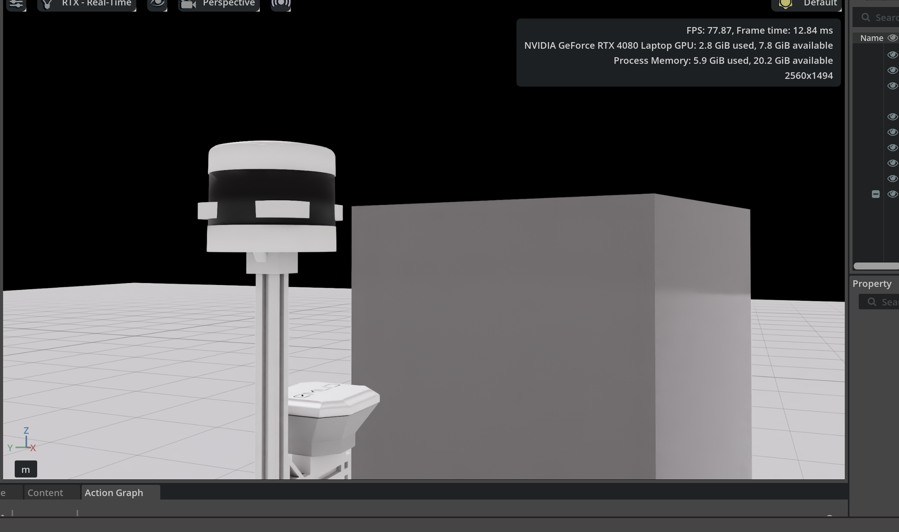
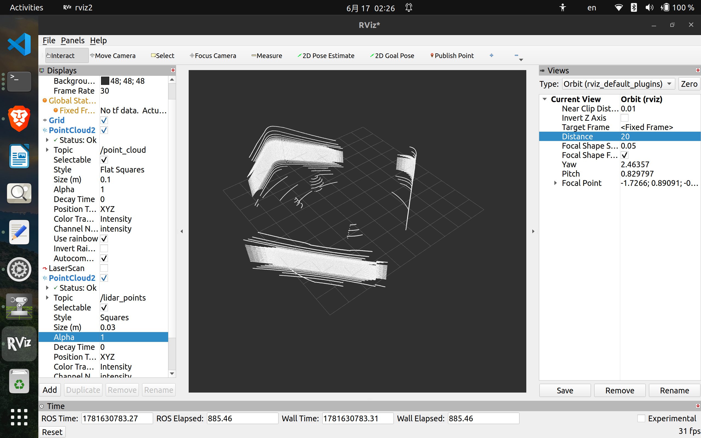
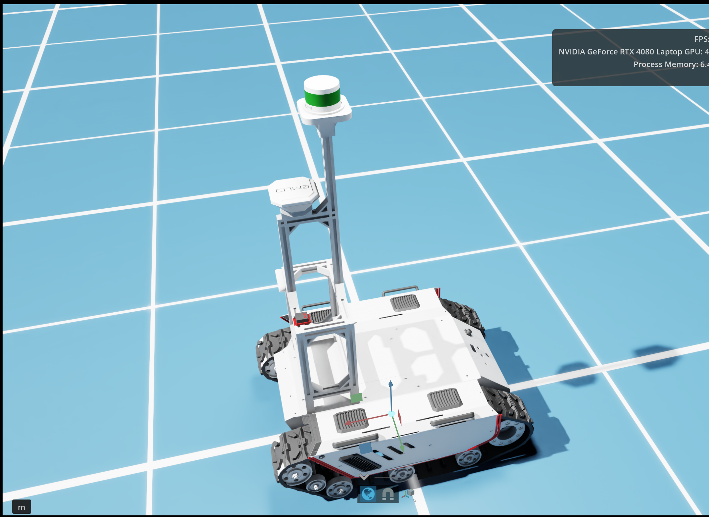
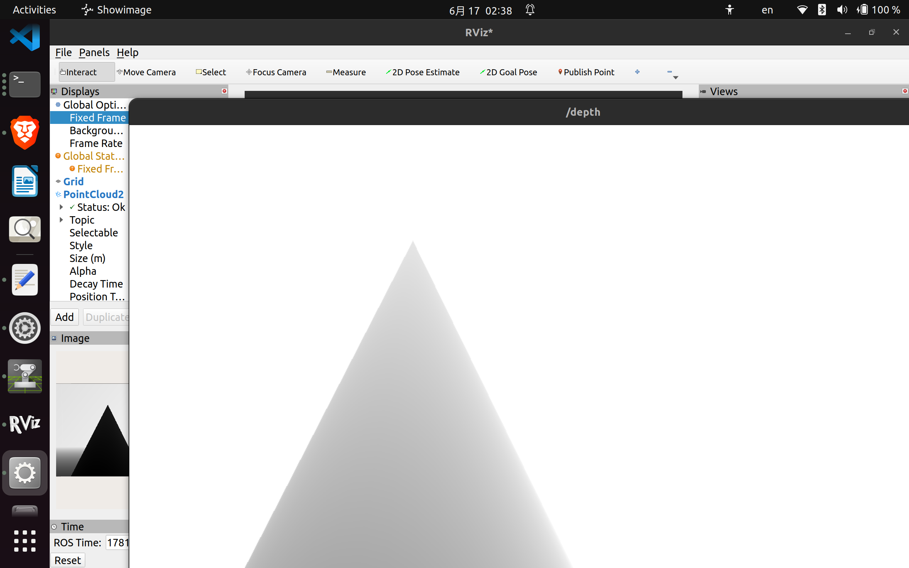

# Isaac Sim Sensor Stack Validation — 2026-06-17

## Objective

Integrate and validate the Bunker sensor stack inside Isaac Sim before SLAM and self-supervised terrain learning development.

---

## LiDAR Integration

### Initial Issue

Imported RTX LiDAR (VLS-128 asset) and connected it to ROS2.

ROS topic was publishing:

```bash
/lidar_points
```

However, point cloud output was extremely sparse.

Observed:

```text
width: 0
width: 8
width: 82
```

RViz showed only a few blinking points.

### Root Cause

The VLS-128 sensor model is physically larger than the original VLP16 mounting location.

The LiDAR origin overlapped with the robot mast/chassis, causing immediate self-intersections and ray occlusion.

#### Sensor Placement Issue



### Fix

Raised the LiDAR sensor along the Z-axis:

```text
Translate Z = +0.06022 m
```

Result:

```bash
ros2 topic echo /lidar_points --once | grep width
```

```text
width: 240012
```

### Validation

Verified PointCloud2 publication.



Topic:

```bash
/ lidar_points
```

Message Type:

```bash
sensor_msgs/msg/PointCloud2
```

Successfully visualized point cloud in RViz2.

Current LiDAR frequency:

```text
~2.8–4 Hz
```

---

## RGB Camera Validation

Verified RGB image publication.

Topic:

```bash
/rgb
```

### Validation



Observations:

- Environment visible
- Cube visible
- Floor visible
- Image displayed successfully in RViz

Frequency:

```text
~6.4 Hz
```

---

## Depth Camera Validation

Verified depth image publication.

Topic:

```bash
/depth
```

Message:

```yaml
encoding: 32FC1
height: 720
width: 1280
frame_id: sim_camera
```

### Validation



Observations:

- Depth image displayed successfully in RViz
- Correct depth gradient observed across cube surface
- Metric depth values being published

Frequency:

```text
~2.2 Hz
```

---

## IMU Validation

Verified IMU publication.

Topic:

```bash
/imu/data
```

Frame:

```text
xsens_imu_link
```

Sample Output:

```yaml
orientation:
  w: 1.0

linear_acceleration:
  z: 9.81
```

Frequency:

```text
~13.6 Hz
```

---

## Camera Calibration Validation

Verified camera calibration publication.

Topic:

```bash
/camera_info
```

Parameters:

```yaml
resolution: 1280x720
distortion_model: plumb_bob
```

Camera intrinsics successfully published.

---

## Active ROS2 Topics

```text
/camera_info
/cmd_vel
/depth
/image_right
/imu/data
/left_image
/lidar_points
/rgb
```

---

## Outstanding Issues

### TF Tree Not Configured

Command:

```bash
ros2 run tf2_tools view_frames
```

Output:

```text
frame_yaml='[]'
```

Current state:

- No TF tree available
- No frame relationships being published

Missing:

```text
/tf
/tf_static
```

---

### Odometry Not Configured

Missing:

```text
/odom
```

Required before:

- RTAB-Map
- Nav2
- Sensor Fusion
- Mapping

---

## Lessons Learned

A major debugging breakthrough occurred during LiDAR validation.

Although ROS2 topics were being published correctly, the point cloud density remained extremely low. Investigation revealed that the imported VLS-128 sensor was physically intersecting with the robot mast due to its larger dimensions compared to the original VLP16 mounting configuration.

Once the LiDAR was elevated slightly above the mounting structure, point cloud density increased from single-digit returns to over 240,000 points per scan.

This confirmed that the sensor pipeline was functioning correctly and the issue was purely geometric rather than software-related.

---

## Next Steps

### Sensor Frame Setup

Configure TF tree:

```text
map
 └── odom
      └── base_link
           ├── velodyne_VLP16_link
           ├── xsens_imu_link
           └── sim_camera
```

### State Estimation

- Publish odometry
- Verify TF visualization in RViz
- Validate frame hierarchy

### SLAM Integration

- Integrate RTAB-Map
- Validate LiDAR and camera synchronization
- Generate occupancy maps
- Begin localization experiments

### Future Work

- Elevation mapping
- Terrain feature extraction
- Self-supervised traversability learning
- Navigation stack integration

---

## Session Outcome

Successfully validated the complete Isaac Sim sensor stack.

### Completed

- [x] LiDAR Integration
- [x] Point Cloud Visualization
- [x] RGB Camera Validation
- [x] Depth Camera Validation
- [x] IMU Validation
- [x] Camera Calibration Validation

### Pending

- [ ] TF Tree
- [ ] Odometry
- [ ] RTAB-Map Integration
- [ ] SLAM Validation

---

## Repository Snapshot

### Isaac Sim Bunker Setup


### LiDAR Point Cloud


### Depth Camera Output


---

**Status:** Sensor stack operational and ready for TF, odometry, SLAM, mapping, and self-supervised learning integration.
